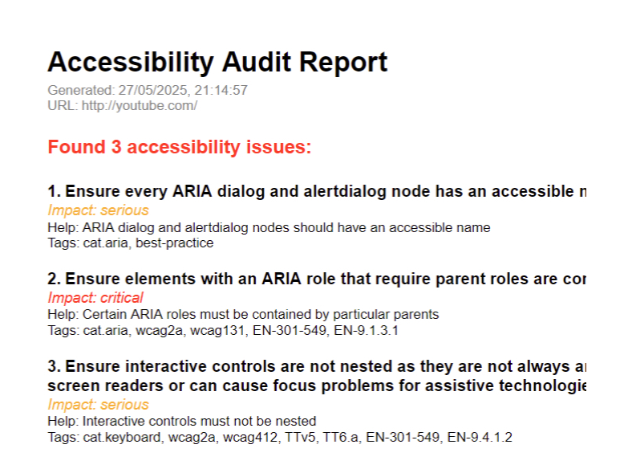

# Accessify ♿🧪

A lightweight, developer-friendly command-line tool that audits any public webpage for accessibility issues using **Puppeteer** and **axe-core**. Supports both **local use** and **CI/CD pipelines**, and can export clean, shareable PDF reports.

---

## 🚀 Features

- Scans any public URL for WCAG violations
- Detects issues like missing alt text, low contrast, invalid landmarks, etc.
- Displays results directly in the terminal, color-coded by severity
- Provides a summary breakdown by impact (`critical`, `serious`, etc.)
- Optionally exports the report as a clean PDF (color-coded as well)
- Auto-generates default report filenames
- Handles broken URLs, unreachable domains, and bad status codes gracefully
- Supports multilingual output via `--lang` flag (e.g., English, Spanish, French, Turkish)

---

## 📦 Installation (Local Dev)

1. **Clone the repository**

```bash
git clone https://github.com/berat-552/accessify.git
cd accessify
```

2. **Install dependecies**

```bash
npm install
```

3. **Link the CLI globally (for local testing)**

```bash
npm link
```

4. **Now you can run the CLI from anywhere on your machine:**

```bash
accessify https://example.com
```

Examples:

```bash
accessify https://www.wikipedia.org
accessify www.github.com
```

## 🌐 Localisation

Accessify supports localization using the `--lang=<code>` flag. Languages include:

- English (en)
- French (fr)
- Turkish (tr)
- Spanish (es)
  Example Output PDF:



## 🛠 Flags

`--ci` — Run in CI mode (no prompts, auto-save PDF)

`--lang=<code>` — Set the language (e.g., en, fr, tr, ar)

`--help` — Show all options and available language codes
